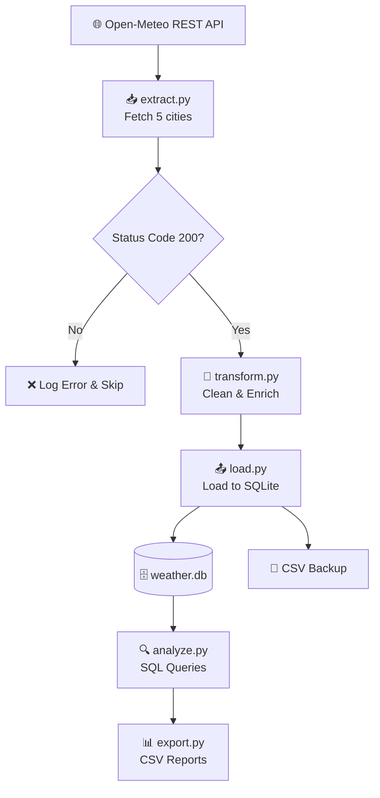

# 🌤️ Weather ETL Pipeline | Python · REST API · SQLite · SQL

---

## 📖 Project Overview

A complete ETL pipeline that fetches live weather data for 5 major 
US cities from a public REST API, cleans and enriches it using Python, 
stores it in a SQLite database, and generates SQL-powered CSV reports.

The pipeline runs as a sequential ETL workflow — from raw API response to structured, 
queryable data — with a timestamped backup for tracking historical runs
---

## 🎯 Business Objective

**Problem:**
Business teams need a reliable way to monitor weather conditions across 
multiple cities without manually checking APIs or spreadsheets every day.

**Solution:**
This pipeline automatically collects, standardizes, and stores weather 
data in a structured database. It answers key business questions like:
- Which city has the most extreme weather today?
- What is the average temperature across all monitored cities?
- Which cities qualify as high-wind risk zones?

---

## 🛠️ Tech Stack

| Tool | Usage in This Project |
|------|-----------------------|
| Python 3 | Core pipeline logic |
| Open-Meteo REST API | Live weather data source |
| SQLite (sqlite3) | Local database to store cleaned data |
| SQL | Business analysis queries |
| CSV (csv module) | Export reports and audit trail backups |
| Git & GitHub | Version control and portfolio hosting |

> 💡 Built using Python standard libraries only — no heavy frameworks —
> to demonstrate strong fundamentals.

---

## 🏗️ Pipeline Flow



---

## 📁 Project Structure

```
weather_etl_pipeline/
├── data/
├── scripts/
│   ├── __init__.py
│   ├── extract.py
│   ├── transform.py
│   ├── database.py
│   ├── load.py
│   ├── analyze.py
│   └── export.py
├── output/
├── .gitignore
├── requirements.txt
└── README.md
```


## 🌐 Data Source

**API:** Open-Meteo Weather API
**URL:** https://open-meteo.com

---

## 🔄 ETL Process

### Extract
- Calls the Open-Meteo API for each city
- Checks the response is successful (status code 200)
- Pulls temperature, wind speed, and weather code

### Transform
- Converts temperature from °C to °F
- Maps weather codes to labels (e.g. 0 → "Clear Sky")
- Classifies wind speed into categories (Calm, Moderate, High Wind)

### Load
- Clears old data before each run
- Inserts clean data into SQLite database — 30 structured data points per execution (5 cities × 6 metrics)
- Saves a timestamped CSV backup as audit trail
## ▶️ How to Run

**1. Clone the repository**
```bash
git clone https://github.com/YOUR_USERNAME/weather-etl-pipeline.git
cd weather-etl-pipeline
```

**2. Create and activate virtual environment**
```bash
python -m venv venv
venv\Scripts\activate        # Windows
source venv/bin/activate     # Mac/Linux
```

**3. Install dependencies**
```bash
pip install -r requirements.txt
```

**4. Run the pipeline step by step**
```bash
python -m scripts.database   # Set up database
python -m scripts.extract    # Fetch live weather data
python -m scripts.transform  # Clean and enrich data
python -m scripts.load       # Load into SQLite
python -m scripts.analyze    # Run SQL queries
python -m scripts.export     # Export CSV reports
```

---

## 📊 Sample Output

### Data loaded into SQLite

| city | temperature_f | windspeed_kmh | wind_category | weather_label |
|------|--------------|---------------|---------------|---------------|
| New York | 62.6 | 12.0 | Moderate | Clear Sky |
| Chicago | 67.6 | 11.6 | Moderate | Clear Sky |
| Houston | 73.4 | 12.0 | Moderate | Overcast |
| Phoenix | 70.0 | 4.7 | Calm | Mainly Clear |
| Cincinnati | 72.7 | 9.1 | Calm | Clear Sky |

### Heat classification report

| city | temperature_f | heat_label |
|------|--------------|------------|
| Houston | 73.4 | Warm |
| Cincinnati | 72.7 | Warm |
| Phoenix | 70.0 | Warm |
| Chicago | 67.6 | Warm |
| New York | 62.6 | Mild |

---

## 👩‍💻 Author

**Manne vaishnavi**

MS in Computer Science

GitHub: https://github.com/mannevi
