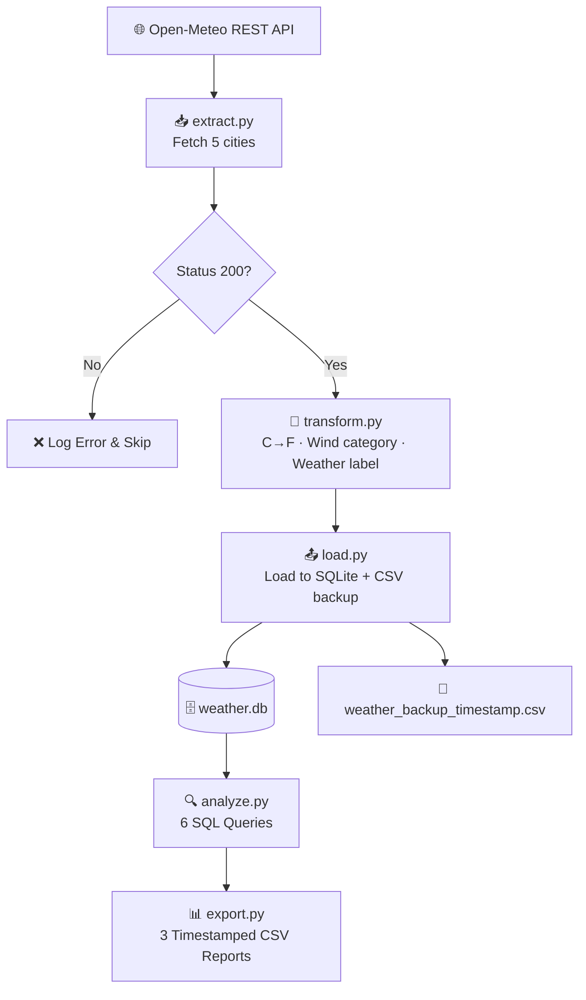

# 🌤️ Weather ETL Pipeline

> Live weather data for 5 US cities — fetched from a REST API, enriched with
> Python, stored in SQLite, and exported as timestamped CSV reports.


---

## 📋 Project Overview

A **production-styled ETL pipeline** that fetches live weather data for 5 major
US cities from the Open-Meteo REST API, enriches it with Python,
stores it in SQLite, and exports timestamped CSV reports.

| | |
|---|---|
| 🌐 **Source** | Open-Meteo REST API — live current weather, no API key needed |
| 🏙️ **Cities** | New York · Chicago · Houston · Phoenix · Cincinnati |
| 🔧 **Database** | SQLite — 1 table, 5 rows, 6 metrics per run |
| 📊 **Analytics** | 6 SQL queries — SELECT, GROUP BY, subquery, CASE WHEN |
| 📁 **Reports** | 3 timestamped CSV reports exported per run |
| 🐳 **Deployed** | Docker — full pipeline runs in under 30 seconds |

> Built using Python standard library + `requests` only —
> no heavy frameworks — to demonstrate strong fundamentals.

---

## 🎯 Business Objective

### Problem
Business teams need a reliable way to monitor weather conditions across
multiple cities without manually checking APIs or spreadsheets every day.

### Solution
This pipeline automatically collects, standardizes, and stores weather
data in a structured database to answer key business questions:

| # | Business Question | SQL Concept |
|---|-------------------|-------------|
| 🌡️ | What is the full weather snapshot across all cities? | `SELECT`, `ORDER BY` |
| 🔥 | Which city is the hottest and coldest right now? | `MAX`, `MIN` |
| 📊 | What is the average temperature and wind speed? | `AVG`, `ROUND` |
| 💨 | How many cities fall into each wind category? | `GROUP BY`, `COUNT` |
| ☀️ | Which cities are warmer than the average? | Subquery |
| 🏷️ | What heat label does each city get? | `CASE WHEN` |

---

## 🛠️ Tech Stack

| Tool | Version | Role in This Project |
|------|---------|----------------------|
| **Python** | 3.11 | Core pipeline language |
| **requests** | 2.33.1 | HTTP calls to Open-Meteo REST API |
| **SQLite** | Built-in | Local database — stores enriched weather data |
| **csv** | Built-in | Timestamped CSV report export + backup |
| **Docker** | — | Containerizes full pipeline — runs anywhere |
| **Open-Meteo API** | — | Free live weather — no API key required |

---

## 🏗️ Pipeline Architecture



> 🐳 **Orchestrated by `main.py`** — runs all 5 steps sequentially
> ⏱️ **Full pipeline completes in under 30 seconds**

---

## 📁 Project Structure

```
weather-etl-pipeline/
│
├── main.py                       ← master orchestrator — runs full pipeline
│
├── scripts/
│   ├── __init__.py
│   ├── database.py               ← create table, clear table, get connection
│   ├── extract.py                ← fetch live weather from Open-Meteo API
│   ├── transform.py              ← C→F conversion, wind category, weather label
│   ├── load.py                   ← load to SQLite + timestamped CSV backup
│   ├── analyze.py                ← 6 SQL business queries
│   └── export.py                 ← export 3 CSV reports
│
├── data/
│   └── weather.db                ← SQLite database (generated at runtime)
│
├── output/                       ← timestamped CSV reports (generated at runtime)
├── Dockerfile                    ← Python 3.11-slim container
├── requirements.txt
└── README.md
```

---

## 🌐 Data Source

**API:** Open-Meteo Current Weather API — `https://api.open-meteo.com/v1/forecast`

| City | Latitude | Longitude |
|------|----------|-----------|
| New York | 40.71 | -74.01 |
| Chicago | 41.85 | -87.65 |
| Houston | 29.76 | -95.37 |
| Phoenix | 33.45 | -112.07 |
| Cincinnati | 39.10 | -84.51 |

**Fields fetched per city:** `temperature` (°C), `windspeed` (km/h), `weathercode`

---

## 🔄 Pipeline Steps

### Step 1 — Database Setup
- Creates `weather` table if it doesn't already exist
- Schema: `id`, `city`, `temperature_c`, `temperature_f`, `windspeed_kmh`, `wind_category`, `weather_label`
- Clears old data before every run — truncate and reload pattern

### Step 2 — Extract
- Calls Open-Meteo API for each of the 5 cities
- Checks `status_code == 200` — logs error and skips city on failure
- Returns raw `temperature`, `windspeed`, `weathercode` per city

### Step 3 — Transform
Three enrichments applied to every city record:

| Enrichment | Logic |
|------------|-------|
| **Temperature** | Converts °C → °F: `round((c × 9/5) + 32, 1)` |
| **Wind Category** | `<10` = Calm · `10–20` = Moderate · `20–35` = High Wind · `≥35` = Storm |
| **Weather Label** | Maps API code → human label (Clear Sky, Rainy, Snowy, Thunderstorm, etc.) |

### Step 4 — Load
- Inserts 5 rows into SQLite `weather` table — **30 data points** (5 cities × 6 metrics)
- Saves a **timestamped CSV backup** as audit trail — one file per run
- Calls `verify_load()` to confirm rows stored successfully

### Step 5 — Export Reports
Three timestamped CSV reports generated per run:

| Report | SQL Used | Contents |
|--------|----------|----------|
| `report_full_snapshot_*.csv` | `SELECT`, `ORDER BY` | All cities ranked by temperature |
| `report_wind_summary_*.csv` | `GROUP BY`, `COUNT`, `AVG` | Wind categories with city count + avg temp |
| `report_heat_classification_*.csv` | `CASE WHEN` | Cities with Hot/Warm/Mild/Cold label |

**Heat label thresholds:**
- 🔴 **Hot** — ≥ 75°F
- 🟠 **Warm** — ≥ 65°F
- 🟡 **Mild** — ≥ 50°F
- 🔵 **Cold** — < 50°F

---

## 🐳 Docker

Run the full pipeline in a container — no local Python setup needed:

```bash
# Build
docker build -t weather-etl-pipeline .

# Run (Windows)
docker run --name weather-pipeline -v %cd%/data:/app/data -v %cd%/output:/app/output weather-etl-pipeline

# Run (Mac/Linux)
docker run --name weather-pipeline -v $(pwd)/data:/app/data -v $(pwd)/output:/app/output weather-etl-pipeline
```

All 5 steps run automatically — database setup → extract → transform → load → export.

---

## ▶️ How to Run

**1. Clone the repository**
```bash
git clone https://github.com/mannevi/weather-etl-pipeline.git
cd weather-etl-pipeline
```

**2. Create virtual environment**
```bash
python -m venv venv
venv\Scripts\activate        # Windows
source venv/bin/activate     # Mac/Linux
pip install -r requirements.txt
```

**3. Run the full pipeline**
```bash
python main.py
```

**Or run step by step**
```bash
python -m scripts.database    # Set up database
python -m scripts.extract     # Fetch live weather data
python -m scripts.transform   # Enrich data
python -m scripts.load        # Load into SQLite
python -m scripts.analyze     # Run SQL queries
python -m scripts.export      # Export CSV reports
```

---

## 📊 Sample Output

### Full weather snapshot
| city | temperature_f | windspeed_kmh | wind_category | weather_label |
|------|--------------|---------------|---------------|---------------|
| Houston | 73.4 | 12.0 | Moderate | Overcast |
| Cincinnati | 72.7 | 9.1 | Calm | Clear Sky |
| Phoenix | 70.0 | 4.7 | Calm | Mainly Clear |
| Chicago | 67.6 | 11.6 | Moderate | Clear Sky |
| New York | 62.6 | 12.0 | Moderate | Clear Sky |

### Heat classification report
| city | temperature_f | weather_label | heat_label |
|------|--------------|---------------|------------|
| Houston | 73.4 | Overcast | Warm |
| Cincinnati | 72.7 | Clear Sky | Warm |
| Phoenix | 70.0 | Mainly Clear | Warm |
| Chicago | 67.6 | Clear Sky | Warm |
| New York | 62.6 | Clear Sky | Mild |

### Wind summary report
| wind_category | city_count | avg_temp_f |
|---------------|------------|------------|
| Calm | 2 | 71.3 |
| Moderate | 3 | 67.9 |

> Sample output files are included in the `output/` folder.

---

## 🧠 What I Built & Learned

| Challenge | How I Solved It |
|-----------|-----------------|
| Live API integration | Called Open-Meteo with `requests`, checked `status_code == 200` before processing |
| Graceful failure handling | Skipped failed cities with a logged error — pipeline continues for remaining cities |
| Data enrichment in Python | Applied C→F conversion, wind classification, weather code mapping — equivalent to SQL CASE WHEN |
| Truncate and reload pattern | Cleared old data before every insert — no duplicate rows across runs |
| Audit trail | Timestamped CSV backup saved on every load — standard production practice |
| Portability | Docker locks Python 3.11 environment — runs identically on any machine |

---

## 🚀 Future Improvements

- [ ] Expand to more cities or international locations
- [ ] Store historical runs instead of truncating — enable trend analysis
- [ ] Add **scheduled execution** — run automatically every hour via cron or Airflow

---

## 👩‍💻 Author

**Manne Vaishnavi**
MS in Computer Science

[](https://github.com/mannevi)
[](https://www.linkedin.com/in/vaishnavimanne/)

---

*Built with live REST API data — no mock data, no static files.*
